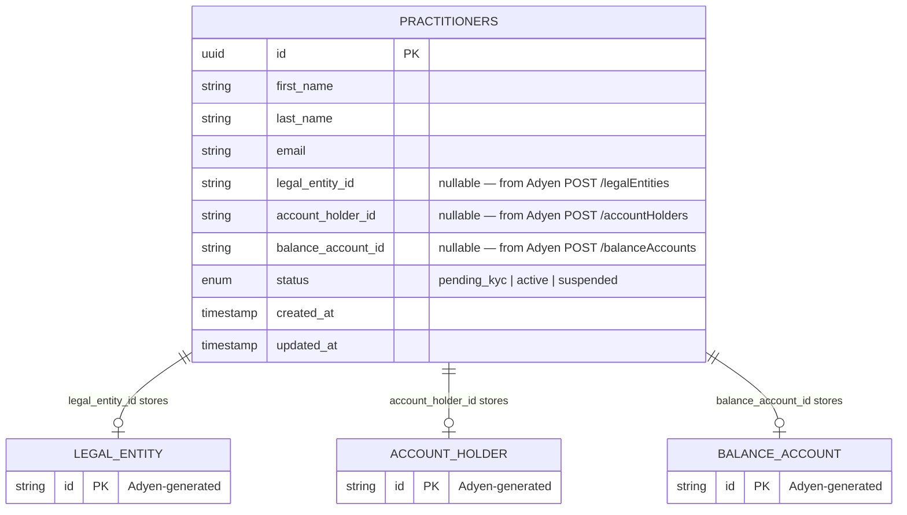
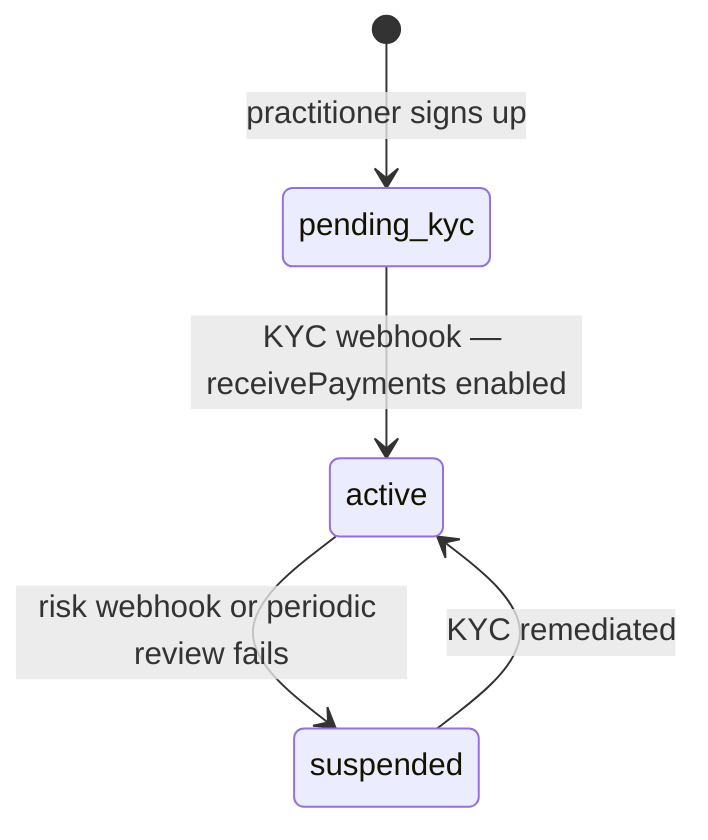

## Status transitions

## Notes

- The three Adyen ID columns are nullable because they are populated sequentially during the three-step onboarding flow
- `status` is the only field that drives payment eligibility — checked in `routes_payments.py` before calling Adyen
- `status` is only ever updated by `routes_webhooks.py` — never by onboarding routes directly
- `updated_at` is auto-updated by SQLAlchemy on every write, useful for debugging webhook delivery timing